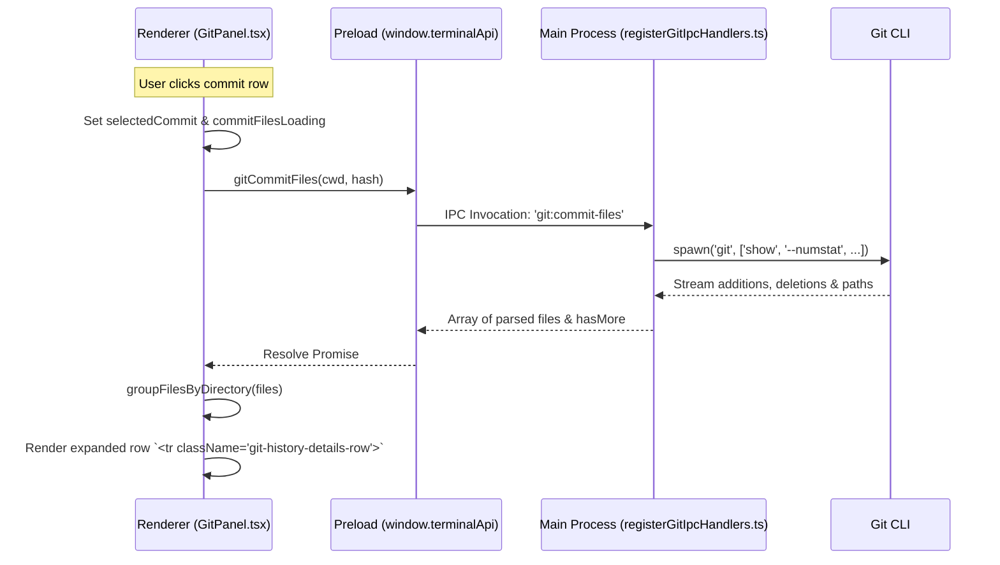

# Git Control History Commit Detail Row

This document describes the design, architecture, and implementation of the **Commit Detail Row** feature within the Git Control sidebar's **History** tab in Carogent Terminal.

---

## Overview

When browsing the Git history graph of a repository, clicking on any commit row expands a nested detail row directly below it. This detail row fetches, groups, and lists all files changed in that specific commit. Selecting any of the files in this list updates the sidebar's diff view to show the modifications made to that file in the commit.

---

## Architectural Workflow

The feature involves coordination between the React renderer process, the preload script, and the Electron main process:

---

## Key Files & Code Symbols

### 1. Main Process: IPC Handlers
* **File:** [registerGitIpcHandlers.ts](file:///Users/huanpham/MyProjects/carogent-wortree/agent-2/src/main/git/registerGitIpcHandlers.ts)
* **API Handlers:**
  * `git:commit-files` triggers [getGitCommitFiles](file:///Users/huanpham/MyProjects/carogent-wortree/agent-2/src/main/git/registerGitIpcHandlers.ts#L358-L415): Executes `git show --numstat --pretty=format: <hash>` to stream and parse file statistics (added/deleted lines count and file path).
  * `git:commit-file-diff` triggers [getGitCommitFileDiff](file:///Users/huanpham/MyProjects/carogent-wortree/agent-2/src/main/git/registerGitIpcHandlers.ts#L417-L432): Runs `git show -m --pretty=format: <hash> -- <path>` to extract file-specific diff content.
* **Constants:**
  * `GIT_COMMIT_FILES_PREVIEW_LIMIT = 400`: The maximum number of changed files returned to prevent UI freeze on huge commits.

### 2. Preload: Bridge APIs
* **File:** [preload/index.ts](file:///Users/huanpham/MyProjects/carogent-wortree/agent-2/src/preload/index.ts)
* **Symbol:** `terminalApi.gitCommitFiles` & `terminalApi.gitCommitFileDiff`
  * Exposes the IPC channel invocations safely to the frontend.

### 3. Renderer Process: UI & Interactions
* **File:** [GitPanel.tsx](file:///Users/huanpham/MyProjects/carogent-wortree/agent-2/src/renderer/src/GitPanel.tsx)
* **State Management:**
  * `selectedCommit`: The currently expanded commit.
  * `commitFiles`: Array of changed files for the expanded commit.
  * `commitFilesLoading`: Boolean for showing the spinner.
  * `selectedCommitFile`: The clicked changed file whose diff is loaded.
  * `commitFilesRequestIdRef`: Ref to tracking request indices, preventing race conditions from rapid clicking.
* **Component Structures:**
  * `<tr className="git-history-details-row">`: Rendered conditionally below the selected commit. It spans all details columns using `colSpan={4}`.
  * [groupFilesByDirectory](file:///Users/huanpham/MyProjects/carogent-wortree/agent-2/src/renderer/src/GitPanel.tsx#L31-L43): Local helper to group flat file paths into directory buckets for a nested display.
  * `handleCommitRowClick`: Callback to toggle the expansion state and trigger `gitCommitFiles` fetch.
  * `handleCommitFileClick`: Callback to fetch individual file diffs when clicked.

### 4. Stylesheet
* **File:** [git-history.css](file:///Users/huanpham/MyProjects/carogent-wortree/agent-2/src/renderer/src/styles/git-history.css)
* **Classes:**
  * `.git-history-details-row`: Container styling for the expanded row.
  * `.git-commit-files-box`: styling for the changed files container box.
  * `.git-commit-file-item`: individual file rows with hover effects (`.git-commit-file-item:hover`).

---

## Detailed Component Anatomy

### 1. Continuity of the History Graph
Within the expanded details row, the first column `col-graph` contains an `<svg>` that draws straight vertical lines matching `row.outgoingTracks`. This ensures that the colored Git commit tree graph lines continue uninterrupted underneath the expanded commit box, preventing visual breaks in the history tree structure.

### 2. Grouped Directory Listing
Instead of showing raw flat paths, files are grouped by their directories:
* **Folder Icon**: Displayed next to the directory name (e.g. `src / renderer / components`).
* **File Items**: Displayed beneath each directory group showing:
  * File icon.
  * File name.
  * Line changes counter: formatted in green (`+X`) and red (`-Y`) monospace text.

### 3. File Cap & Truncation
If a commit modifies more than `400` files, the list is capped at the limit in both the main process and the renderer. A label `... and X more files not shown.` is displayed at the bottom of the list to notify the user.

---

## Error & Race Condition Prevention
* **Request ID Check**: Each time a commit is clicked, a unique `requestId` is generated. All async responses compare their local `requestId` to `commitFilesRequestIdRef.current`. If they do not match, the response is discarded. This prevents stale results from overwriting state if the user clicks other commits before the previous calls complete.
* **Loading Spinner**: A custom `.git-spinner` is displayed while the file list is fetching, ensuring visual responsiveness.
* **Fallback for empty commits**: Renders `No changed files found.` if the commit contains no modifications.
